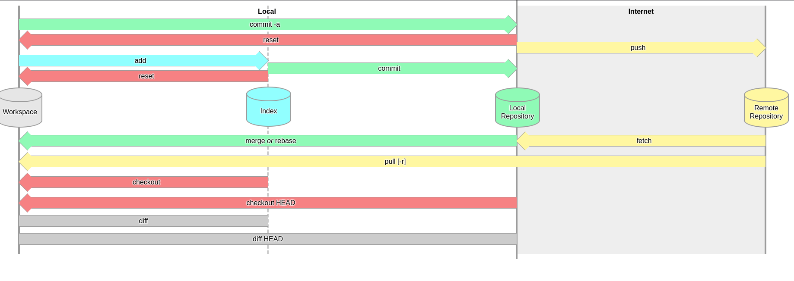
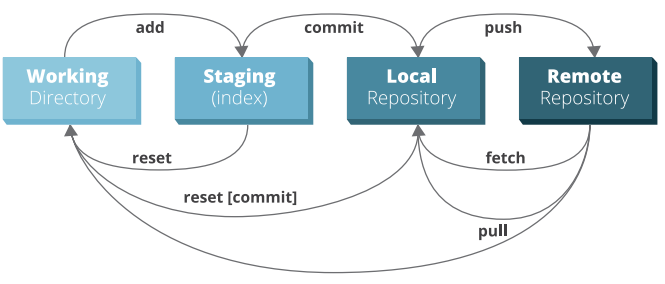

# git-training-sessions - Main Page and index

## Intro: Give brief on working-tree(working area), index(Staging area), local-repo, remote repo.

## Ordered Agenda
 1. Give an explanation about working-tree,index, local-repo, and remote repo.
 2. Explain what is HEAD in git\
   a. Where is my HEAD - and How it gets updated\
   b. What is fast-forward merge and recursive 3 ways merge.\
   c. What is a detached HEAD state and how to get out of this state.
 3. Integrating changes - Rebase vs Merge

 4. [Talk about use cases for starting repos and bring examples](./starting-a-repo.md)
 5. [Talk about working in parallel on at least 2 branches and bring examples](./juggle-between-features.md)
 6. [Discuss about ways to resolve merge and rebase conflicts ](./merging-and-solving-conflicts.md)
 7. [Illustrate Several ways how to recover lost data/commits](./recover-lost-commits-or-work.md)
 8. [Discuss about Rebase use cases and when tu use and when not to use, including demos](./rebase-use-cases.md)
 9. [Show variety of git commands and usages, some of them advanced, including demos. ](./advanced--msc-use-cases.md)
     

## The following git commands are in the scope of git advanced sessions:
git remote

git reset --hard --soft --mixed

git rm -rf --cached

git add [--intent-to-add] [-A] [-u - only tracked files]

git fetch [--prune] , [--all] , fetch remote/origin(update remote refs) 

git pull -- dry-run , --rebase

git stash save, apply, pop,clear,show

git rebase -i(demo at the bottom)

git rebase change "forked from" branch - git rebase --onto=main oldForkBranch newForkBranch

git rebase insert a new commit in the middle of commits tree(all commits after new commit will be re-hashed, so it's only suitable for trees that their "right part/upper part" wasn't published to remote repo - optional.

git restore --staged --worktree

git revert - will be show how to use in the git bisect demo

common checkout usages(beside switching between branches in local repo):

git checkout specific file from ref \
git checkout -b to start new branch \
git checkout to resolve conflicts with ours/theirs \
checkout from a commit from git log or HEAD~n from git reflog \
git checkout --orphan to start a branch with new history, \
git checkout HEAD . --no-overlay eliminate all indexed and not staged files from index and working tree(like git reset --hard)
git checkout -p , interactively select chunks of a ref/commit/ref+(directory/file).

git push -u origin new-branch-name(along with git checkout -b new-branch-name). \
git push -f(when you have no choice) \
git push remote localbranch:remotebranch. \

git commit -a --amend --no-edit --signoff by user.
git log branch_name/tag name

git diff HEAD, --cached(only comparing staged files with reference to HEAD/Commit ID.

git diff COMMIT_ID/REF/tag.

git diff REF1, REF2.

git merge --squash branch/ref/commit.

git merge git merge -s recursive -Xtheirs / -Xours / <allow-unrelated-histories>
 
git mergetool(show with meld in demo)

git show commit-id [--name-only] [--format=email/fuller]

git blame -  git blame hello.there -l(long revisions)

git merge -s octopus HEAD@{1} HEAD@{6} / branchA BranchB BranchC...\

git cherry-pick (-n) commit_id

git rev-list --all --count
 
git rev-parse HEAD/ref
 
 git submodule(optional)
 
git reflog HEAD/{branchName}
 
(*)git request-pull -p start-commit, repo/url, end commit
 
 ## git interactive rebase demo(git rebase -i)
 [Link to repo](https://github.com/zvigrinberg/git-interactive-rebase-demo/)
 
 ## git bisect demo
 Link to repo that show how to use git bisect with example [can be found here](https://github.com/zvigrinberg/git-bisect-demo)
 
 
